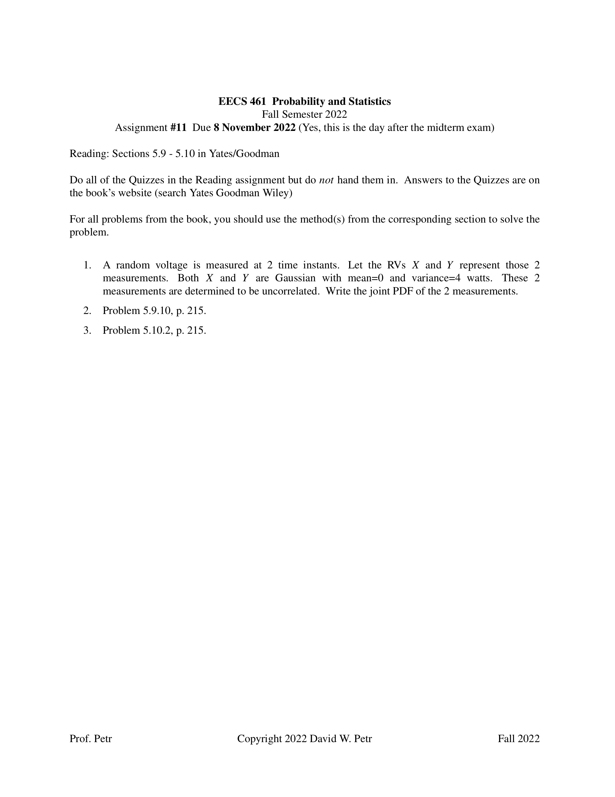
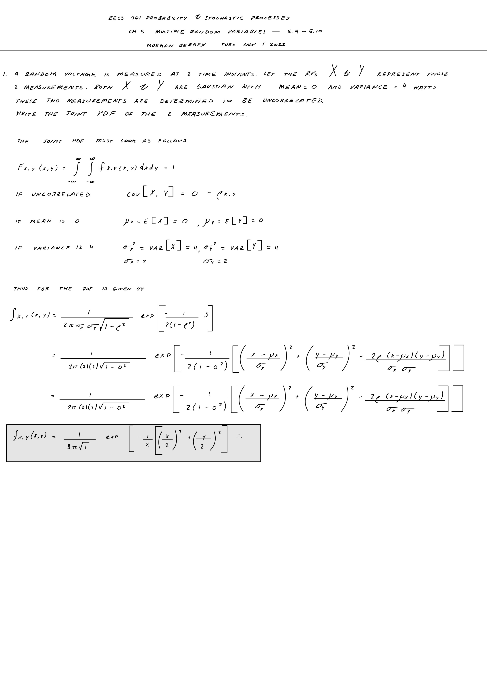
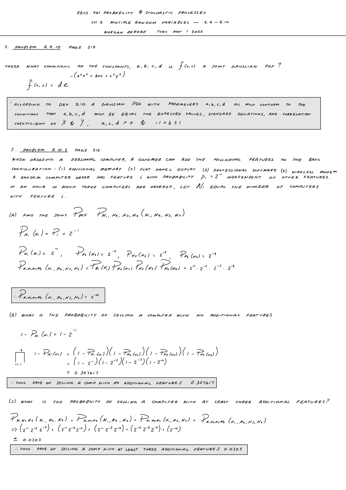

# Probability and Stochastic Processes

### Multiple Random Variables
**Bivariate gaussian random variables**

The bivariate gaussian PDF of _X_ and _Y_ has five parameters:  the expected values and standard deviations of _X_ and _Y_ and the correlation coefficient of _X_ and _Y_.  The marginal PDF of _X_ and marginal PDF of _Y_ are both Gaussian.

**Multivariate probability models**

The probability model of an experiment that produces variables can be represented as an n-dimensional CDF.  If all of the random variables are discrete, there is a corresponding n-dimensional PMF.  If all of teh random variables are continuous, there is an n-dimensional PDF.  The PDF is the nth partial derivative of the CDF with respect to all n variables.  The probability model (CDF, PMF, or PDF) of n independent random varibales is the product of the univariate probability models of the n random variables.

